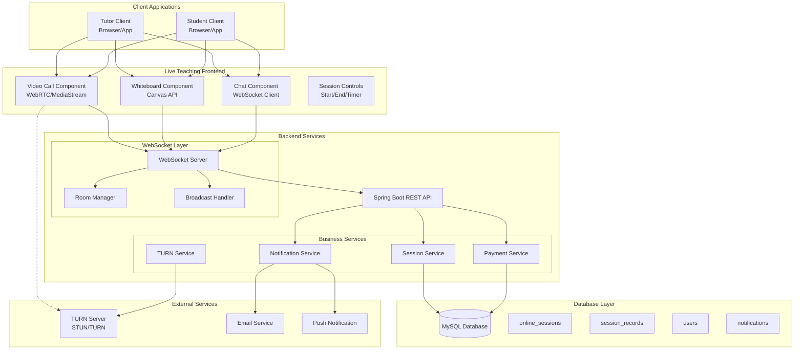
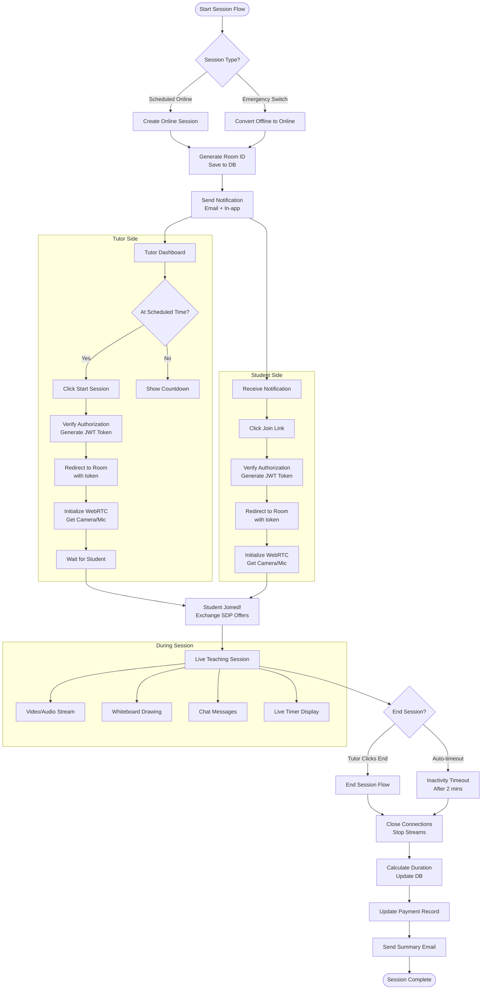
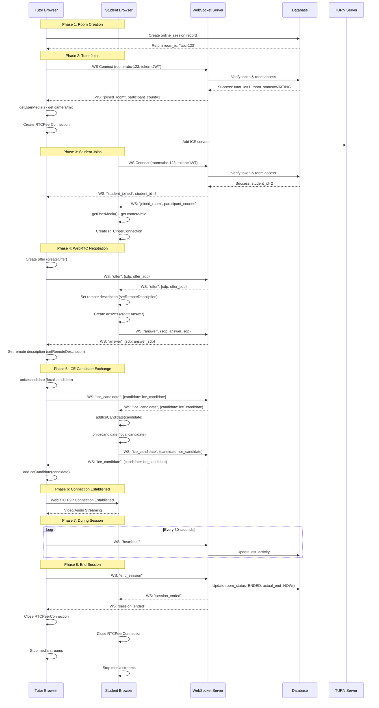
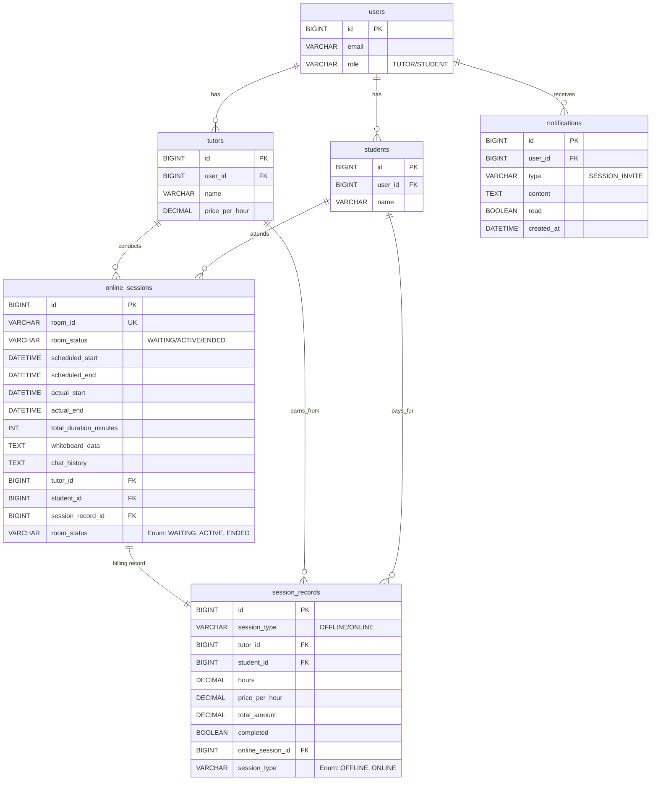
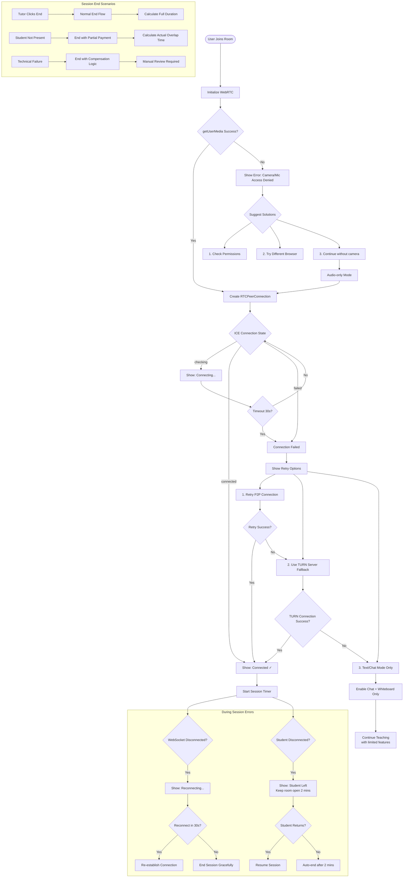
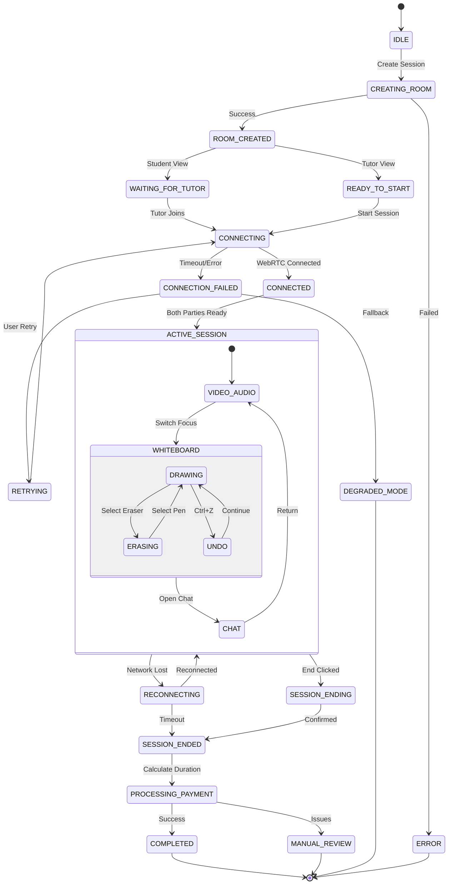

# 🎯 LIVE TEACHING FEATURE - COMPLETE WORKFLOW & ARCHITECTURE

## **1. SYSTEM ARCHITECTURE OVERVIEW**



**Bước 1: Client khởi tạo**

```
1. Tutor/Student mở trình duyệt
2. Load trang web → tải các component:
   - Video Call (WebRTC)
   - Whiteboard (Canvas)
   - Chat (WebSocket client)
3. User click "Join Room"
```

**Bước 2: Xác thực & Kết nối**

```
4. Frontend gửi request tới REST API:
   GET /api/rooms/{roomId}/join

5. Backend kiểm tra:
   - User có thuộc room này không?
   - Room còn active không?
   - Đã đến giờ chưa?

6. Nếu hợp lệ → tạo JWT token chứa:
   {
     room_id: "abc-123",
     user_id: 123,
     role: "TUTOR",
     exp: 5 phút sau
   }

7. Trả token về frontend
```

**Bước 3: Kết nối WebSocket**

```
8. Frontend mở kết nối WebSocket:
   ws://your-domain.com/ws?token=JWT_TOKEN

9. WebSocket Server:
   - Validate token
   - Thêm user vào room
   - Broadcast "user_joined" tới mọi người trong room
```

**Bước 4: WebRTC Connection**

```
10. Frontend gọi getUserMedia() để lấy camera/mic
11. Tạo RTCPeerConnection
12. Thêm TURN server configuration
13. Trao đổi SDP offer/answer qua WebSocket
14. Trao đổi ICE candidates
15. Khi thành công → hiển thị video của nhau
```

**Bước 5: Trong suốt session**

```
16. Mỗi 30 giây gửi "heartbeat" qua WebSocket
17. Mọi tin nhắn chat gửi qua WebSocket
18. Mọi stroke trên whiteboard gửi qua WebSocket
19. Backend lưu chat_history, whiteboard_data vào DB
```

**Bước 6: Kết thúc session**

```
20. Tutor click "End Session"
21. Frontend đóng WebRTC connection
22. Gửi "session_ended" qua WebSocket
23. Backend tính thời gian, cập nhật DB
24. Backend tính toán payment
25. Gửi notification cho student
```

## **2. USER FLOW DIAGRAM**



### **Tutor muốn tạo online session:**

**Trường hợp A: Tạo mới hoàn toàn**

```
Step 1: Vào dashboard → click "Create Online Session"
Step 2: Chọn student từ dropdown
Step 3: Chọn ngày, giờ, môn học
Step 4: Click "Create"
Step 5: Hệ thống tự động:
   - Tạo room_id (UUID)
   - Lưu vào bảng online_sessions
   - Gửi email + notification cho student
```

**Trường hợp B: Chuyển từ offline sang online (trời mưa)**

```
Step 1: Vào dashboard → xem scheduled sessions
Step 2: Click session bị ảnh hưởng
Step 3: Click "Switch to Online"
Step 4: Hệ thống:
   - Tạo online_session record
   - Update session_record.session_type = "ONLINE"
   - Gửi notification khẩn cho student
   - Student nhận được link join ngay
```

### **Student nhận invitation:**

```
Step 1: Nhận email "Your online session invitation"
Step 2: Click link trong email hoặc vào app
Step 3: Thấy button "Join Online Session"
Step 4: Đến đúng giờ → click "Join"
Step 5: Được redirect tới room với token
Step 6: Cho phép camera/mic → vào phòng
```

### **Trong room:**

```
Giai đoạn 1: Chờ (Waiting Room)
- Tutor đã vào, chờ student
- Hiển thị "Waiting for student..."
- Có thể test camera/mic

Giai đoạn 2: Kết nối (Connecting)
- Student join → bắt đầu WebRTC handshake
- Hiển thị "Connecting..." (5-10 giây)
- Nếu fail → tự động retry

Giai đoạn 3: Dạy học (Live Teaching)
- Video/Audio: hoạt động
- Whiteboard: cả 2 vẽ được
- Chat: nhắn tin được
- Timer: đếm thời gian
```

### **Kết thúc session:**

```
Cách 1: Tutor chủ động kết thúc
- Click "End Session"
- Xác nhận "Are you sure?"
- Hệ thống tự động tính giờ, lưu DB

Cách 2: Auto timeout
- Student disconnect > 2 phút
- Hệ thống tự động end session
- Tính thời gian thực tế cả 2 online
```

## **3. WEBRTC CONNECTION SEQUENCE**



**Phase 1: Tạo Room (Backend)**

```java
// Bước này xảy ra khi tutor tạo session
public OnlineSession createOnlineSession(CreateSessionRequest request) {
    OnlineSession session = new OnlineSession();
    session.setRoomId(UUID.randomUUID().toString());
    session.setTutorId(request.getTutorId());
    session.setStudentId(request.getStudentId());
    session.setRoomStatus("WAITING"); // Trạng thái chờ
    session.setScheduledStart(request.getStartTime());
    session.setScheduledEnd(request.getEndTime());
    
    // Lưu vào DB
    return onlineSessionRepository.save(session);
}
```

**Phase 2: Tutor Join Room**

```java
// Frontend code - tutor side
async function tutorJoinRoom(roomId) {
  // 1. Lấy token từ backend
  const token = await fetch(`/api/rooms/${roomId}/join-token`);
  
  // 2. Kết nối WebSocket với token
  const ws = new WebSocket(`ws://your-server/ws?token=${token}`);
  
  // 3. Yêu cầu camera/mic
  const stream = await navigator.mediaDevices.getUserMedia({
    video: true,
    audio: true
  });
  
  // 4. Hiển thị video local
  localVideo.srcObject = stream;
  
  // 5. Tạo RTCPeerConnection
  const pc = new RTCPeerConnection({
    iceServers: [
      { urls: 'stun:stun.l.google.com:19302' },
      // Có thể thêm TURN server sau
    ]
  });
  
  // 6. Thêm stream vào connection
  stream.getTracks().forEach(track => {
    pc.addTrack(track, stream);
  });
  
  // 7. Chờ student join...
}
```

**Phase 3: Student Join & WebRTC Negotiation**

```java
// Khi student join, backend gửi event qua WebSocket
ws.onmessage = (event) => {
  const data = JSON.parse(event.data);
  
  if (data.type === 'student_joined') {
    // Student đã vào room, bắt đầu WebRTC negotiation
    
    // 1. Tutor tạo offer
    const offer = await pc.createOffer();
    await pc.setLocalDescription(offer);
    
    // 2. Gửi offer qua WebSocket
    ws.send(JSON.stringify({
      type: 'offer',
      sdp: offer.sdp
    }));
  }
  
  if (data.type === 'answer') {
    // Nhận answer từ student
    await pc.setRemoteDescription(new RTCSessionDescription({
      type: 'answer',
      sdp: data.sdp
    }));
  }
  
  if (data.type === 'ice_candidate') {
    // Thêm ICE candidate
    await pc.addIceCandidate(new RTCIceCandidate(data.candidate));
  }
};
```

**Phase 4: ICE Candidate Exchange - QUAN TRỌNG**

```
WebRTC cần biết "địa chỉ mạng" của mỗi bên.
Quá trình này gọi là ICE (Interactive Connectivity Establishment).

Tutor side:
1. pc.onicecandidate được trigger mỗi khi có candidate mới
2. Gửi candidate qua WebSocket tới student
3. Student nhận được → pc.addIceCandidate(candidate)

Student side:
1. Cũng tạo candidates của mình
2. Gửi ngược lại cho tutor
3. Tutor addIceCandidate

Sau khi có đủ candidates → kết nối P2P được thiết lập.
Nếu P2P fail → cần dùng TURN server làm relay.
```

**Phase 5: Giám sát connection state**

```java
// Theo dõi trạng thái kết nối
pc.onconnectionstatechange = () => {
  console.log('Connection state:', pc.connectionState);
  
  switch(pc.connectionState) {
    case 'connected':
      // Thành công! Hiển thị video remote
      showSuccess('Connected!');
      break;
      
    case 'failed':
      // Thất bại, thử lại
      showError('Connection failed. Retrying...');
      setTimeout(retryConnection, 3000);
      break;
      
    case 'disconnected':
      // Mất kết nối tạm thời
      showWarning('Disconnected. Reconnecting...');
      break;
  }
};

// Nhận stream từ remote
pc.ontrack = (event) => {
  // Hiển thị video của đối phương
  remoteVideo.srcObject = event.streams[0];
};
```

## **4. DATABASE SCHEMA RELATIONSHIPS**



**Bảng online_sessions - QUAN TRỌNG NHẤT**

```sql
-- Cột QUAN TRỌNG cần hiểu:
1. room_id: VARCHAR(100) UNIQUE
   - UUID để identify room: "abc-123-def-456"
   - Dùng trong URL: /room/abc-123-def-456
   - UNIQUE để tránh trùng

2. room_status: VARCHAR(20)
   - WAITING: Đang chờ (chưa ai join)
   - ACTIVE: Đang diễn ra (có người trong room)
   - ENDED: Đã kết thúc

3. scheduled_start vs actual_start:
   - scheduled_start: Giờ dự kiến bắt đầu (lúc tạo session)
   - actual_start: Giờ thực tế bắt đầu (khi tutor click start)
   - Lưu cả 2 để biết student có join trễ không

4. tutor_joined_at vs student_joined_at:
   - Lưu thời điểm mỗi người join
   - Tính billable time = thời gian cả 2 cùng online
   - Ví dụ: tutor vào 18:00, student vào 18:10
     → Billable time bắt đầu từ 18:10

5. total_duration_minutes:
   - Tổng thời gian session (tính bằng phút)
   - Được tính khi session end
   - Công thức: actual_end - MAX(tutor_joined_at, student_joined_at)

6. whiteboard_data: TEXT
   - Lưu JSON array của tất cả strokes
   - Format:
     [
       {
         "type": "draw",
         "points": [[x1,y1], [x2,y2], ...],
         "color": "#000000",
         "width": 2,
         "timestamp": "2024-01-15T10:30:00"
       },
       ...
     ]
   - Có thể restore whiteboard từ data này

7. chat_history: TEXT
   - Tương tự, lưu JSON array của chat messages
```

**Bảng session_records - Link với Payment**

```sql
-- Thay đổi QUAN TRỌNG:
ALTER TABLE session_records
ADD COLUMN session_type VARCHAR(20) DEFAULT 'OFFLINE';
-- Giá trị: 'OFFLINE' hoặc 'ONLINE'

ADD COLUMN online_session_id BIGINT;
-- Foreign key tới online_sessions.id
-- Nếu session_type = 'ONLINE' thì cột này NOT NULL

-- Logic tính tiền:
1. Nếu OFFLINE: 
   hours = tutor nhập manual
   
2. Nếu ONLINE:
   hours = online_sessions.total_duration_minutes / 60.0
   → Tự động tính, không cần tutor nhập
```

**Flow lưu data khi session end:**

```java
@Transactional
public void endSession(String roomId) {
    // 1. Lấy session từ DB
    OnlineSession session = onlineSessionRepo.findByRoomId(roomId);
    
    // 2. Tính thời gian
    LocalDateTime sessionStart = session.getActualStart();
    LocalDateTime sessionEnd = LocalDateTime.now();
    
    long minutes = Duration.between(sessionStart, sessionEnd).toMinutes();
    session.setTotalDurationMinutes((int) minutes);
    session.setRoomStatus("ENDED");
    
    // 3. Lưu whiteboard data (nếu có)
    if (whiteboardService.hasData(roomId)) {
        String whiteboardJson = whiteboardService.exportData(roomId);
        session.setWhiteboardData(whiteboardJson);
    }
    
    // 4. Lưu chat history
    String chatJson = chatService.exportChat(roomId);
    session.setChatHistory(chatJson);
    
    // 5. Cập nhật session_record
    SessionRecord record = session.getSessionRecord();
    if (record != null) {
        record.setHours(minutes / 60.0);
        record.setTotalAmount(record.getPricePerHour() * record.getHours());
        record.setCompleted(true);
    }
    
    // 6. Save all
    onlineSessionRepo.save(session);
    sessionRecordRepo.save(record);
}
```

## **5. ERROR HANDLING FLOWCHART**



**Lỗi 1: Không lấy được camera/mic**

```
Nguyên nhân:
- User chưa cho phép permission
- Trình duyệt không hỗ trợ
- Camera/mic bị chương trình khác dùng

Xử lý:
Step 1: Try catch getUserMedia()
Step 2: Nếu lỗi → hiển thị hướng dẫn:
   "Please allow camera/microphone access"
   "Click here to check browser permissions"
Step 3: Offer fallback:
   "Continue with audio only?"
   "Continue with text chat only?"
```

**Code xử lý:**

```jsx
try {
  const stream = await navigator.mediaDevices.getUserMedia({
    video: true,
    audio: true
  });
} catch (error) {
  console.error('Camera/mic error:', error);
  
  if (error.name === 'NotAllowedError') {
    // User từ chối permission
    showPermissionInstructions();
  } else if (error.name === 'NotFoundError') {
    // Không tìm thấy camera/mic
    offerAudioOnlyMode();
  } else {
    // Lỗi khác
    fallbackToChatOnly();
  }
}
```

**Lỗi 2: WebRTC connection fail**

```
Nguyên nhân:
- NAT/Firewall chặn P2P
- Mạng yếu
- TURN server không hoạt động

Xử lý theo thứ tự:
Step 1: Đợi 30 giây cho P2P tự kết nối
Step 2: Nếu fail → thử dùng TURN server
Step 3: Nếu vẫn fail → chuyển sang audio-only
Step 4: Cuối cùng → chat-only mode
```

**Retry logic:**

```jsx
const MAX_RETRIES = 3;
let retryCount = 0;

async function connectWithRetry() {
  try {
    await establishWebRTCConnection();
  } catch (error) {
    retryCount++;
    
    if (retryCount >= MAX_RETRIES) {
      // Đã thử 3 lần vẫn fail
      if (hasTURNServer) {
        // Thử TURN server
        await connectViaTURN();
      } else {
        // Fallback tới audio-only
        offerAudioOnly();
      }
    } else {
      // Retry với exponential backoff
      const delay = Math.pow(2, retryCount) * 1000; // 2s, 4s, 8s
      setTimeout(connectWithRetry, delay);
    }
  }
}
```

**Lỗi 3: Student disconnect đột ngột**

```
Xử lý:
Step 1: WebSocket phát hiện disconnect
Step 2: Hiển thị "Student disconnected. Waiting..."
Step 3: Giữ room mở thêm 2 phút
Step 4: Nếu student quay lại trong 2 phút:
   - Tự động reconnect
   - Restore whiteboard state
   - Continue session
Step 5: Nếu quá 2 phút:
   - Tự động end session
   - Tính thời gian thực tế
   - Gửi notification "Session ended due to inactivity"
```

**Backend cleanup job:**

```java
@Scheduled(fixedRate = 60000) // Chạy mỗi phút
public void cleanupInactiveRooms() {
    // Tìm rooms ACTIVE nhưng không có activity > 2 phút
    List<OnlineSession> inactiveRooms = repository.findInactiveRooms(
        LocalDateTime.now().minusMinutes(2)
    );
    
    for (OnlineSession room : inactiveRooms) {
        room.setRoomStatus("ENDED");
        room.setActualEnd(room.getLastActivityAt());
        
        // Tính thời gian thực tế
        long minutes = calculateActualMinutes(room);
        room.setTotalDurationMinutes(minutes);
        
        repository.save(room);
        
        // Gửi notification
        notificationService.sendSessionEndedNotification(room);
    }
}
```

**Lỗi 4: Payment calculation sai**

```
Nguyên nhân:
- Thời gian join/leave không chính xác
- Server time vs client time mismatch
- Bug trong công thức tính

Debug checklist:
1. Kiểm tra tutor_joined_at và student_joined_at
2. Kiểm tra actual_start và actual_end
3. So sánh với timer trên client
4. Verify công thức tính:

   billable_minutes =
     MIN(
       (tutor_left_at OR actual_end) - tutor_joined_at,
       (student_left_at OR actual_end) - student_joined_at
     )

   Nghĩa là: chỉ tính thời gian cả 2 cùng online
```

**SQL để debug:**

```sql
-- Query để kiểm tra thời gian
SELECT 
    room_id,
    tutor_joined_at,
    student_joined_at,
    actual_start,
    actual_end,
    
    -- Thời gian tutor online
    TIMESTAMPDIFF(MINUTE, tutor_joined_at, 
        COALESCE(actual_end, NOW())) AS tutor_minutes,
    
    -- Thời gian student online  
    TIMESTAMPDIFF(MINUTE, student_joined_at,
        COALESCE(actual_end, NOW())) AS student_minutes,
    
    -- Billable time (thời gian overlap)
    TIMESTAMPDIFF(MINUTE,
        GREATEST(tutor_joined_at, student_joined_at),
        COALESCE(actual_end, NOW())
    ) AS billable_minutes
    
FROM online_sessions 
WHERE id = ?;
```

## **6. MOBILE RESPONSIVE LAYOUT**

```mermaid
graph TB
    subgraph "Desktop Layout (1024px+)"
        D1[Header: Timer & Controls]
        D2[Video Grid: 2x1<br/>Tutor Large, Student Small]
        D3[Whiteboard: Full Width]
        D4[Chat: Side Panel]
        
        D1 --> D2
        D2 --> D3
        D3 --> D4
    end
    
    subgraph "Tablet Layout (768px-1023px)"
        T1[Header: Timer & Controls]
        T2[Video Grid: 1x2<br/>Side by Side]
        T3[Whiteboard: Main Area]
        T4[Chat: Collapsible Panel]
        
        T1 --> T2
        T2 --> T3
        T3 --> T4
    end
    
    subgraph "Mobile Layout (<768px)"
        M1[Header: Timer<br/>Menu Button]
        
        subgraph "Tab Navigation"
            M2[Video Tab]
            M3[Whiteboard Tab]
            M4[Chat Tab]
        end
        
        M5[Active Tab Content]
        M6[Floating Controls<br/>Mic/Camera/End]
        
        M1 --> M2
        M1 --> M3
        M1 --> M4
        M2 --> M5
        M3 --> M5
        M4 --> M5
        M5 --> M6
    end
    
    subgraph "Mobile Video Layout"
        MV1[Portrait: Stacked Videos]
        MV2[Landscape: Side by Side]
        MV3[Picture-in-Picture Option]
        MV4[Toggle Camera/Mic]
    end
    
    subgraph "Mobile Whiteboard"
        MW1[Touch Drawing]
        MW2[Pinch-to-Zoom]
        MW3[Undo/Redo Gestures]
        MW4[Color Palette Bottom]
    end
```




**Layout cho Mobile (<768px):**

```
Ý tưởng: Dùng tab navigation thay vì hiển thị cùng lúc

Tab 1: Video
- Hiển thị video của cả 2
- Có thể switch giữa front/back camera
- Button mute/unmute, camera on/off

Tab 2: Whiteboard
- Canvas chiếm toàn màn hình
- Toolbar ở dưới: pen, eraser, color
- Pinch-to-zoom để zoom in/out

Tab 3: Chat
- Danh sách messages
- Input box ở dưới cùng
- Có thể gửi ảnh (nếu cần)

Floating buttons:
- Mic on/off (luôn hiển thị)
- Camera on/off
- End session
- Switch tab
```

**Code structure:**

```html
<div class="mobile-container">
  <!-- Header với timer -->
  <div class="header">
    <div class="timer">00:45:23</div>
    <button class="menu-btn">☰</button>
  </div>
  
  <!-- Tab navigation -->
  <div class="tabs">
    <button class="tab active" data-tab="video">🎥 Video</button>
    <button class="tab" data-tab="whiteboard">📝 Board</button>
    <button class="tab" data-tab="chat">💬 Chat</button>
  </div>
  
  <!-- Content area -->
  <div class="tab-content">
    <div id="video-tab" class="tab-pane active">
      <!-- Video grid -->
    </div>
    <div id="whiteboard-tab" class="tab-pane">
      <!-- Canvas -->
    </div>
    <div id="chat-tab" class="tab-pane">
      <!-- Chat messages -->
    </div>
  </div>
  
  <!-- Floating controls -->
  <div class="floating-controls">
    <button class="mic-btn">🎤</button>
    <button class="camera-btn">📷</button>
    <button class="end-btn">⏹️ End</button>
  </div>
</div>
```

**Xử lý touch events cho whiteboard:**

```jsx
// Mobile: dùng touch events thay vì mouse events
canvas.addEventListener('touchstart', handleTouchStart);
canvas.addEventListener('touchmove', handleTouchMove);
canvas.addEventListener('touchend', handleTouchEnd);

function handleTouchStart(e) {
  e.preventDefault(); // Ngăn scroll
  
  const touch = e.touches[0];
  const rect = canvas.getBoundingClientRect();
  
  // Tính toán tọa độ
  const x = touch.clientX - rect.left;
  const y = touch.clientY - rect.top;
  
  // Bắt đầu stroke
  currentStroke = {
    points: [[x, y]],
    color: currentColor,
    width: currentWidth
  };
  
  // Vẽ điểm đầu tiên
  drawPoint(x, y);
}

function handleTouchMove(e) {
  e.preventDefault();
  
  const touch = e.touches[0];
  const rect = canvas.getBoundingClientRect();
  
  const x = touch.clientX - rect.left;
  const y = touch.clientY - rect.top;
  
  // Thêm điểm vào stroke
  currentStroke.points.push([x, y]);
  
  // Vẽ line từ điểm trước tới điểm này
  drawLine(
    currentStroke.points[currentStroke.points.length - 2],
    [x, y]
  );
  
  // Gửi qua WebSocket (throttle)
  sendStrokeData(currentStroke);
}
```

## **7. STATE MANAGEMENT FLOW**



**Các state QUAN TRỌNG cần theo dõi:**

```jsx
const roomState = {
  // Connection state
  wsConnected: false,  // WebSocket connected?
  peerConnected: false, // WebRTC connected?
  
  // Room info
  roomId: null,
  roomStatus: 'WAITING', // 'WAITING', 'ACTIVE', 'ENDED'
  
  // Participants
  participants: {
    tutor: { id: null, joinedAt: null, online: false },
    student: { id: null, joinedAt: null, online: false }
  },
  
  // Media state
  media: {
    localStream: null,
    remoteStream: null,
    audioEnabled: true,
    videoEnabled: true
  },
  
  // Session timing
  timer: {
    startTime: null,
    elapsedSeconds: 0,
    billableSeconds: 0
  }
};
```

**2. Whiteboard State:**

```jsx
const whiteboardState = {
  // Drawing state
  isDrawing: false,
  currentStroke: null,
  
  // History for undo/redo
  history: [],
  historyIndex: -1,
  
  // Tools
  currentTool: 'pen', // 'pen', 'eraser', 'text'
  currentColor: '#000000',
  currentWidth: 2,
  
  // Sync state
  pendingSync: [], // Strokes chưa gửi lên server
  lastSyncedAt: null
};
```

**3. Chat State:**

```jsx
const chatState = {
  messages: [
    {
      id: 1,
      sender: 'TUTOR',
      text: 'Hello!',
      timestamp: '2024-01-15T10:30:00',
      read: true
    }
  ],
  
  unreadCount: 0,
  isTyping: false,
  lastMessageAt: null
};
```

### **State transitions - Chuyển đổi trạng thái:**

**Khi tutor start session:**

```
WAITING → CONNECTING
Điều kiện: tutor click "Start Session"
Hành động:
1. Set roomStatus = 'CONNECTING'
2. Lưu startTime = now()
3. Gửi WebSocket event 'session_started'
4. Bắt đầu đếm timer
```

**Khi student join:**

```
CONNECTING → ACTIVE
Điều kiện: student connected + WebRTC established
Hành động:
1. Set roomStatus = 'ACTIVE'
2. Lưu student.joinedAt = now()
3. Bắt đầu tính billable time
4. Gửi notification 'session_active'
```

**Khi mất kết nối:**

```
ACTIVE → RECONNECTING
Điều kiện: WebSocket disconnect hoặc WebRTC fail
Hành động:
1. Set roomStatus = 'RECONNECTING'
2. Hiển thị "Reconnecting..."
3. Bắt đầu đếm timeout (2 phút)
4. Tự động retry connection
```

**Persistence - Lưu state khi refresh:**

```jsx
// Lưu state vào localStorage mỗi 10 giây
setInterval(() => {
  const stateToSave = {
    roomId: roomState.roomId,
    whiteboardData: whiteboardState.history,
    chatHistory: chatState.messages,
    lastSavedAt: new Date().toISOString()
  };
  
  localStorage.setItem(`room_${roomState.roomId}`, 
    JSON.stringify(stateToSave));
}, 10000);

// Khi user rejoins (sau khi refresh)
function restoreSession(roomId) {
  const saved = localStorage.getItem(`room_${roomId}`);
  if (saved) {
    const data = JSON.parse(saved);
    
    // Restore whiteboard
    whiteboardState.history = data.whiteboardData || [];
    redrawWhiteboard();
    
    // Restore chat
    chatState.messages = data.chatHistory || [];
    renderChatMessages();
    
    // Clear saved data
    localStorage.removeItem(`room_${roomId}`);
  }
}
```

## **8. MONITORING & ANALYTICS**

```mermaid
graph TB
    subgraph "Real-time Monitoring"
        M1[WebSocket Connections Count]
        M2[Active Rooms Count]
        M3[P2P vs TURN Usage]
        M4[Connection Success Rate]
        M5[Average Connection Time]
        M6[Session Duration Distribution]
    end
    
    subgraph "Performance Metrics"
        P1[Video Quality: 480p/720p/1080p]
        P2[Bitrate: kbps]
        P3[Packet Loss %]
        P4[Jitter ms]
        P5[Latency ms]
        P6[Whiteboard Sync Delay]
    end
    
    subgraph "Business Metrics"
        B1[Online Sessions per Day]
        B2[Conversion Rate: Offline→Online]
        B3[Revenue Protected]
        B4[Tutor Adoption Rate]
        B5[Student Satisfaction]
        B6[Technical Issue Rate]
    end
    
    subgraph "Error Tracking"
        E1[Failed Joins]
        E2[Media Permission Denials]
        E3[ICE Connection Failures]
        E4[WebSocket Timeouts]
        E5[Browser Compatibility]
        E6[Payment Calculation Errors]
    end
    
    subgraph "Alert System"
        A1[High Failure Rate >5%]
        A2[TURN Server Overload]
        A3[Database Connection Issues]
        A4[WebSocket Server High Load]
        A5[Payment Sync Failures]
        A6[Zero Sessions Alert]
    end
    
    M1 --> Dashboard
    M2 --> Dashboard
    P1 --> Dashboard
    P2 --> Dashboard
    B1 --> Dashboard
    B2 --> Dashboard
    E1 --> Alert
    E2 --> Alert
    A1 --> Alert
    A2 --> Alert
    
    Dashboard --> Grafana
    Alert --> Slack
    Alert --> Email
    
    Grafana --> Actions
    Slack --> Actions
    
    Actions --> ScaleUp[Scale WebSocket Servers]
    Actions --> FixBug[Investigate High Error Rate]
    Actions --> UpdateTURN[Add TURN Capacity]
    Actions --> NotifyTeam[Manual Intervention]
```



### **Các metrics CẦN theo dõi:**

**1. Real-time Dashboard:**

```
/metrics/rooms
- Tổng số rooms đang active
- Số users online
- Connection success rate

/metrics/performance
- Average connection time
- Video quality distribution
- WebSocket message latency
```

**2. Đặt alerts khi:**

```yaml
# Alert rules:
- Connection success rate < 95% trong 5 phút
- TURN server usage > 80%
- Database connection failed
- Payment calculation error > 1%

# Notification channels:
- Slack: #alerts-live-teaching
- Email: dev-team@company.com
- SMS (critical): +84xxx (chỉ P0)
```

**Logging structure cho debug:**

```jsx
// Mọi event quan trọng đều log
function logEvent(eventType, data) {
  const logEntry = {
    timestamp: new Date().toISOString(),
    roomId: currentRoomId,
    userId: currentUserId,
    event: eventType,
    data: data,
    
    // Thông tin mạng
    networkType: navigator.connection?.effectiveType,
    iceConnectionState: peerConnection?.iceConnectionState,
    
    // Session info
    elapsedTime: timerState.elapsedSeconds
  };
  
  // Gửi tới logging service
  sendLogToServer(logEntry);
  
  // Đồng thời lưu localStorage để debug offline
  saveToLocalLog(logEntry);
}
```

**Các event BẮT BUỘC phải log:**

```jsx
1. User events:
   - user_joined_room
   - user_left_room
   - media_permission_granted/denied
   - session_started
   - session_ended

2. Connection events:
   - websocket_connected/disconnected
   - webrtc_offer_sent/received
   - webrtc_answer_sent/received  
   - ice_candidate_exchanged
   - connection_state_changed

3. Error events:
   - getusermedia_failed
   - webrtc_connection_failed
   - websocket_error
   - sync_failed (whiteboard/chat)

4. Business events:
   - timer_started/paused
   - payment_calculated
   - notification_sent
```

**Debug query mẫu:**

```sql
-- Tìm session có vấn đề về thời gian
SELECT 
    os.id,
    os.room_id,
    os.tutor_joined_at,
    os.student_joined_at,
    os.actual_start,
    os.actual_end,
    os.total_duration_minutes,
    
    sr.hours AS billed_hours,
    sr.total_amount,
    
    -- Tính toán để so sánh
    TIMESTAMPDIFF(MINUTE, os.actual_start, os.actual_end) AS actual_minutes,
    os.total_duration_minutes AS recorded_minutes,
    
    -- Chênh lệch
    ABS(TIMESTAMPDIFF(MINUTE, os.actual_start, os.actual_end) 
        - os.total_duration_minutes) AS discrepancy_minutes
    
FROM online_sessions os
LEFT JOIN session_records sr ON sr.online_session_id = os.id
WHERE os.room_status = 'ENDED'
  AND ABS(TIMESTAMPDIFF(MINUTE, os.actual_start, os.actual_end) 
        - os.total_duration_minutes) > 5  -- Chênh lệch >5 phút
ORDER BY discrepancy_minutes DESC;
```

## **📋 IMPLEMENTATION CHECKLIST**

### **Week 1-2: Foundation**

- [ ]  Database schema migration
- [ ]  Room management REST API
- [ ]  JWT token generation for rooms
- [ ]  WebSocket room handling
- [ ]  Basic room page UI

```
[ ] 1. Tạo migration script cho bảng online_sessions
[ ] 2. Tạo REST API:
    - POST /api/sessions/online (tạo session)
    - GET /api/rooms/{id}/join-token (lấy token)
    - POST /api/rooms/{id}/end (kết thúc)
[ ] 3. WebSocket handlers:
    - Join room
    - Leave room
    - Broadcast messages
[ ] 4. JWT token generation cho rooms
[ ] 5. Unit tests cho các API
```

### **Week 3-4: Core Features**

- [ ]  WebRTC P2P connection
- [ ]  Video/audio components
- [ ]  Session timer & tracking
- [ ]  Payment integration
- [ ]  Notification system

```
[ ] 1. Room page UI cơ bản
[ ] 2. WebRTC connection:
    - getUserMedia()
    - RTCPeerConnection
    - SDP exchange
[ ] 3. Video display:
    - Local video preview
    - Remote video display
    - Controls (mute, camera toggle)
[ ] 4. Session timer
[ ] 5. Basic error handling
```

### **Week 5-6: Enhanced Features**

- [ ]  Whiteboard with Canvas API
- [ ]  Real-time drawing sync
- [ ]  Chat system
- [ ]  File sharing (optional)
- [ ]  Mobile responsive design

```
[ ] 1. Canvas drawing
[ ] 2. WebSocket sync cho whiteboard
[ ] 3. Chat UI & messaging
[ ] 4. File sharing (nếu có)
[ ] 5. Mobile responsive
```

### **Week 7-8: Production Ready**

- [ ]  TURN server integration
- [ ]  Error handling & reconnection
- [ ]  Performance optimization
- [ ]  Security hardening
- [ ]  Load testing
- [ ]  Documentation

```markdown
[ ] 1. TURN server integration
[ ] 2. Reconnection logic
[ ] 3. Performance optimization
[ ] 4. Security audit
[ ] 5. Load testing
[ ] 6. Documentation
```

### **Testing Requirements**

- [ ]  Cross-browser testing (Chrome, Firefox, Safari)
- [ ]  Mobile testing (iOS Safari, Android Chrome)
- [ ]  Network condition testing (3G, poor WiFi)
- [ ]  Load test (10+ concurrent rooms)
- [ ]  Security penetration testing
- [ ]  Payment accuracy testing

---

## **KHI CÓ BUG - QUY TRÌNH DEBUG**

### **Bug: "Không vào được room"**

```
Step 1: Kiểm tra frontend console log
Step 2: Kiểm tra WebSocket connection
Step 3: Kiểm tra JWT token có valid không
Step 4: Kiểm tra database xem room có tồn tại không
Step 5: Kiểm tra room_status phải là WAITING hoặc ACTIVE
```

### **Bug: "Không thấy video của nhau"**

```
Step 1: Kiểm tra camera/mic permission
Step 2: Kiểm tra WebRTC connection state
Step 3: Kiểm tra ICE candidates có trao đổi không
Step 4: Thử dùng TURN server
Step 5: Kiểm tra firewall/NAT settings
```

### **Bug: "Whiteboard không sync"**

```
Step 1: Kiểm tra WebSocket connection
Step 2: Kiểm tra message có được gửi không
Step 3: Kiểm tra message có được receive không
Step 4: Kiểm tra drawing code có lỗi không
Step 5: Kiểm tra throttle logic (quá nhiều messages)
```

### **Bug: "Tính tiền sai"**

```
Step 1: Kiểm tra tutor_joined_at và student_joined_at
Step 2: Kiểm tra actual_start và actual_end
Step 3: Kiểm tra công thức tính total_duration_minutes
Step 4: Kiểm tra timezone có đúng không
Step 5: So sánh với timer trên client
```

## **📞 SUPPORT & ESCALATION**

### **Khi user báo lỗi, hỏi ngay:**

```
1. Dùng trình duyệt gì? Version?
2. Dùng điện thoại hay máy tính?
3. Lỗi xảy ra khi nào? (lúc join, trong session, lúc end)
4. Có thấy thông báo lỗi gì không?
5. Đã thử refresh chưa?
6. Đã thử trình duyệt khác chưa?
```

### **Các log cần thu thập để debug:**

```
1. Room ID của session
2. Thời gian xảy ra lỗi (chính xác đến phút)
3. Screenshot lỗi (nếu có)
4. Console log từ browser (F12 → Console)
5. Network log (F12 → Network, xem WebSocket messages)
```

---

## **🚨 CRITICAL SUCCESS FACTORS**

1. **Connection Speed**: <10 seconds from click to video
2. **Video Quality**: Minimum 480p, target 720p
3. **Audio Quality**: Clear, no echo, <200ms latency
4. **Sync Accuracy**: Whiteboard <100ms delay
5. **Reliability**: 99% session completion rate
6. **Security**: Zero unauthorized access incidents
7. **Billing Accuracy**: 100% correct payment calculation
8. **Mobile Support**: Works on iOS 12+, Android 8+

---

## **💡 PRO TIPS FOR IMPLEMENTATION**

1. **Start Simple**: Get basic video working before adding whiteboard/chat
2. **Use Existing Infrastructure**: Reuse WebSocket connections from notifications
3. **Test Network Conditions**: Use Chrome DevTools to simulate 3G/poor connection
4. **Implement Analytics Early**: Track every failure to identify patterns
5. **Plan for Scale**: Room isolation allows horizontal scaling
6. **Document Edge Cases**: Timezone differences, daylight saving, payment disputes
7. **Create Admin Tools**: Manual override for technical issues
8. **User Education**: Clear tutorials for non-tech-savvy tutors